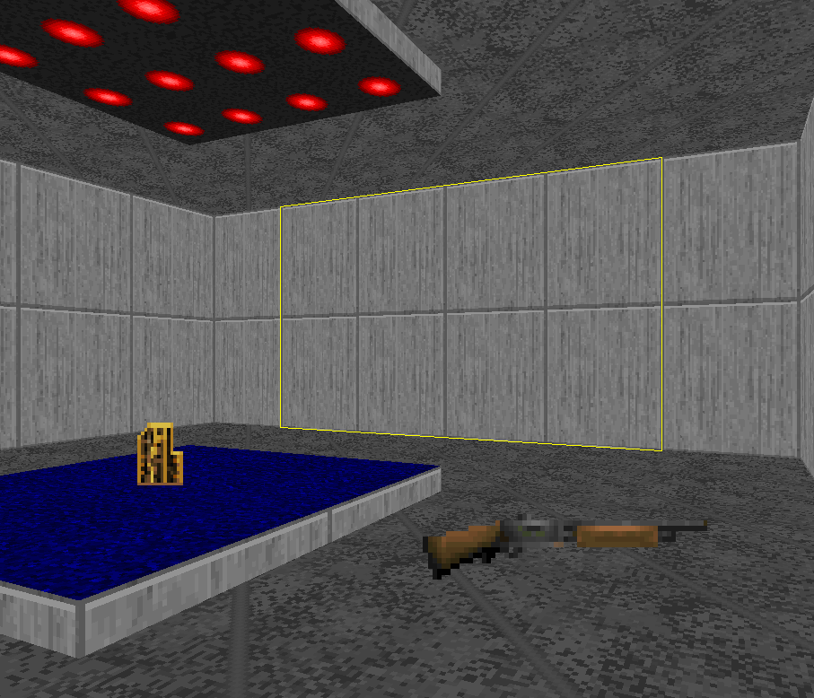

Traps
=====

Examples
--------

All trap examples can be played in :download:`traps.wad`

Monster Closet
--------------

Monsters are staged in a hidden room with a door disguised as a wall or other nondescript panel, which opens to surprise the player.

* Create a sector that will be your hidden closet.
* Add some monsters inside it.
* Join it with your room using a door-like sector:

.. image:: monster_closet_01.png

* Close the closet door so that it looks like a normal wall:

* In sector edit mode, hover over the closet door sector, give it a fresh tag (shortcut :kbd:`;` then :kbd:`f`).
* In vertice edit mode, add the linedef that will trigger the closet to open, when the player walks over the line.
* In linedef edit mode, select the trigger lines and set the last used tag on the linedefs (shortcut :kbd:`;` then :kbd:`l`). The trigger lines must have the same tag as the closet door sector.
* Assign the linedef special *Type 109 W1 Open and stay fast* to the trigger line:

.. image:: monster_closet_03.png

Monster Platform
----------------

Monsters are staged atop a wall that lowers to surprise the player.

Crushers
--------

The ceiling lowers, crushing the player.

.. note::

    You will need to unpeg the lower walls so they do not move up and down with the crushing ceiling.

Hole Trap
---------

A section of the floor drops out under the player,

Lock-In Trap
------------

Close the player in the room for a short period forcing them into combat

Teleport Ambush
---------------

Monsters stationed in a hidden room waken to the sound of gunfire, walk over a teleport trigger and summon themselves to a designated location.

Combat Teleporting
------------------

Use Type 126 WR Teleport /mon in a combat zone to warp monsters around the player while combat is taking place. This trap is used in Doom II map 10 to great effect with a Cyberdemon.

Nukage Surprise
---------------

A floor turns into radioactive waste, dealing damage to the player when walked on.

Exploding Barrels
-----------------
