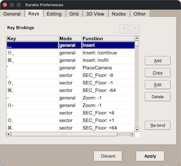

Key System
==========

Eureka has a flexible system for binding commands (editing functions) to specific keys on the keyboard and buttons on the mouse.  These bindings can be created and modified in the Preferences window, in the "Keys" tab (described below).

For a description of all the commands, see the `CommandList <../command-list/index.html>`__ page.

----

Key Names
---------

Key names in the bindings list are based on what usually appears on the keyboard.  Letter keys are lowercase without any modifiers, for example: 'a', and are uppercase when used with the **SHIFT** key, for example: 'A'.  All other usage of the **SHIFT** modifier will show it explicitly.

Some common key names:

    **SPACE** : the Spacebar key

    **BS** : the Backspace key

    **INS** : the Insert key

    **DEL** : the Delete key

    **PGUP** : the Page-Up key

    **PGDN** : the Page-Down key

    **MENU** : the Menu key (only on some keyboards)

    **F1**, **F2**, **F3** (etc) : the function keys

The mouse buttons also have names, as follows:

    **MOUSE1** : the left mouse button

    **MOUSE2** : the middle mouse button (or clickable wheel)

    **MOUSE3** : the right mouse button

    **WHEEL_UP** : mouse wheel pushed up (forward)

    **WHEEL_DOWN** : mouse wheel pushed down (backward)

    **WHEEL_LEFT** : mouse wheel pushed left

    **WHEEL_RIGHT** : mouse wheel pushed right

Lastly, the names of some keys may be unknown.  These can still be used, but they will be shown as a cryptic code number.  For example, the left "Windows" key may be shown as **0xfe03**.

----

Modifiers
---------

Modifiers are the keys like **SHIFT** and **CTRL** which you can hold down in addition to a normal key.  Modifiers can be used with mouse buttons too, including the mouse wheel.

Modifiers cannot be bound to commands by themselves, they require another normal key or button.  There is no distinction between left or right versions of a modifier key.  Another restriction is that only one modifier can be used in a binding, so you cannot bind SHIFT+CTRL+SPACE to a command.

The following modifiers are supported:

    **SHIFT** : all keyboards have this.

    **CTRL** : the control key. Under macOS this will be shown as "CMD" instead, and refers to the command key.

    **ALT** : most keyboards have **ALT** keys, however on Linux this modifier is often used by the window manager to perform window management tasks, making it less useful for bindings.

    **META** : an additional modifier key which some keyboards have, e.g. in Linux the "Windows" key is sometimes usable for this.  Eureka can generate fake META events by pressing the **;** key followed by a normal key, which can be useful for binding extra commands. Under macOS, use the native Control key.

    **LAX** : this is not a real modifier key!  Instead this means that the binding will match in a lax way, where the current state of the **SHIFT** and **CTRL** modifiers is ignored.  This is useful for the navigation commands, which change speed depending on whether the **SHIFT** or **CTRL** modifiers are pressed.

----

Command Syntax
--------------

Commands are actions or functions which the editor can do.  They may be something which modifies the map in same way, like deleting a sector, or they may simply change something in the interface, such as toggling the 3D view on/off.

The syntax of commands is based loosely on DOS syntax.  Some commands require a parameter or two, and some commands have optional  "flags" which are keywords that being with a '/' (forward slash).  Multiple flags can be present, and each one will affect the behavior of the command in some way.

Examples:

    **UnselectAll**

        A command with no parameters and no flags.  It simply unselects all objects in the selection.

    **Zoom +1**

        A command with a single parameter, "+1", which tells the Zoom command to zoom in (whereas "-1" would tell it to zoom out).

    **SEC_SelectGroup /floor_h /floor_tex**

        This command is used to select contiguous sectors, and here it has two flags: the **/floor_h** flag means the sectors must have the same floor height, and the **/floor_tex** flag means the sectors must have the same floor texture.

----

Special Prefixes
----------------

Some commands can only be used in a certain editing mode, and these commands have a prefix designating the mode, as follows:

    **LIN_xxx** : only usable in Linedefs mode

    **SEC_xxx** : only usable in Sectors mode

    **TH_xxx** : only usable in Things mode

    **VT_xxx** : only usable in Vertex mode

    **3D_xxx** : only usable in the 3D view

    **BR_xxx** : only usable when the Browser is open

There are a few commands which have a purely descriptive prefix, but are not limited to any particular mode, for example: **GRID_Set**.

Commands which contain "**WHEEL_**" can only be used with the mouse-wheel.  Binding these commands to any other key or button will not work.

Commands containing "**ACT_**" and "**NAV_**" are ones which require you to hold the key or button down, such as scrolling the map with the cursor keys.  Such commands will not work when bound to the mouse-wheel or certain keys on the keyboard, such as **CAPSLOCK**, **NUMLOCK** and **PAUSE**, because these keys behave differently from normal keys.

----

Binding Keys
------------

You can create a brand new binding by clicking the "Add" button, or modify an existing binding by selecting the binding in the list and clicking the "Edit" button.  The "Copy" button creates a copy of an existing binding and brings up the edit dialog for it.  To remove a key binding altogether, click the "Delete" button.

The "Re-bind" button lets you assign a new key to the currently selected binding.  That binding will turn yellow and wait for the next key or mouse button to be pressed.  Pressing the **ESC** key cancels that process.

.. note::

   NOTE: like other preference settings, changes made to the key bindings are *only* kept when clicking the "Apply" button at the bottom of the preferences window.  Use the "Discard" button if you decide you don't want to keep your changes, e.g. if you accidentally deleted some bindings.

The key-editing dialog allows you to change any aspect of a key binding.  A new key name can be typed into the "Key" box, but an easier way is to press the "Re-bind" button, which will wait for the next key or button press.  Use the **ESC** key to cancel that process.  The "Choose" button lets you pick a different function to use, and the "Mode" button can limit the binding to a particular editing mode.

Most functions require at least one parameter, a few require two or more parameters, and many functions support several optional flags.  The full set of parameters can be typed into the "Params" box, though for commands which use a keyword it is easier to pick the keyword directly from the "Keywords" menu.  Also flags may be added or removed by choosing them in the "Flags" menu.
