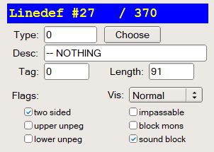

User Interface
==============

Eureka features a 2D orthogonal view and a 3D view. Switch between the two views with the :kbd:`tab` key.

.. image:: 2d-view.png

*The 2D view is used to construct walls and place things on the map*

.. image:: 3d-view.png

*The 3D view is used to preview textures and make ceiling, floor and light adjustments*

Panning and Zooming
-------------------

To move around the 2D view:

* Roll the mouse wheel to zoom
* Click and drag with the middle mouse button (mouse wheel) to pan
* Hold the :kbd:`a` key to pan with the mouse
* Press :kbd:`home` to zoom the whole map into view
* Use the arrow keys

The Camera
----------

This arrow in 2D view indicates the current position of the 3D camera.

* Press :kbd:`'` (single quote) in the 2D view to position the 3D camera at the location of the mouse cursor.
* Press :kbd:`end` in 2D view to center the map on the camera position.

.. image:: camera.png

When in the 3D view you can control camera movement with the following controls:

* Roll the mouse wheel to move forward/backward
* Click and drag left/right with the middle mouse button to rotate the view
* Click and drag up/down with the middle mouse button to raise/lower the view
* Use the arrow and the :kbd:`w`, :kbd:`a`, :kbd:`s`, :kbd:`d`` keys

The Grid
--------

Toggle the grid in 2D view with the **Grid** dropdown box (located on the bottom status bar), or by pressing :kbd:`g`. You can quickly change the grid size with the :kbd:`0-9` keys.

Toggle free mode / grid snapping with the :kbd:`f` key.

.. image:: 2d-grid.png

.. note::

    If you encounter lag while panning a large zoomed-out map, disable grid rendering with :kbd:`g` while panning.

Rendering Mode
--------------

The 2D View can render sectors to display their floor or ceiling flats, light levels or sound propagation. You can change the sector rending mode by using the `Rend` dropdown on the status bar, or by pressing the :kbd:`F8` key to bring up the rendering popup.

The status bar dropdown:

.. image:: sector-rendering-dropdown.png

The :kbd:`F8` popup menu:

.. image:: sector-rendering-statusbar.png

Floor sector rendering
^^^^^^^^^^^^^^^^^^^^^^

This mode draws the floor textures of sectors.

.. image:: sector-rendering-floors.png

Ceiling sector rendering
^^^^^^^^^^^^^^^^^^^^^^^^

This mode draws the ceiling textures of sectors.

.. image:: sector-rendering-ceilings.png

Lighting sector rendering
^^^^^^^^^^^^^^^^^^^^^^^^^

The light render mode draws shades of sector light levels.

.. image:: sector-rendering-lighting.png

Sound sector rendering
^^^^^^^^^^^^^^^^^^^^^^

The sound render mode highlights sectors based on how sound travels. You have to be in sector edit mode for this mode to work (press :kbd:`s`), hover your mouse cursor over a sector to see how sound will propagate.

* Orange sectors indicate where sound will reach at volume 2, the initial and loudest volume.
* Red sectors indicate where sound will reach at volume 1.
* Blue sectors indicate sectors where sound does not reach.

When sound travels across a Linedef that has the `sound block` flag set, the volume is reduced by 1. Thus sound traveling across two or more blocking Linedefs will not be heard by monsters.
By setting the `sound block` flag on Linedefs, you can lower the volume of traveling sounds. Sounds do not travel across two sound-blocking lines.

.. image:: sector-rendering-sound.png

The sound block flag on a Linedef:

Find and Replace
----------------

Open the find panel with the `View / Find` menu or press :kbd:`control-f`.

You can search for Things, line textures, sector flats, lines by type (specials) or sectors by type.

.. image:: find-panel.png

Browsers
--------
Eureka includes several browsers to help you find and select textures, flats, things and specials.
You can open a browser from the main menu under `Browsers`, or by selecting an element from the side
panel.

Advanced source ports allow placing wall and floor/ceiling textures on any surface type. By default
Eureka has separate browsers for each type, but you can opt to keep them together in the same view
by enabling `combine flats and textures in a single browser` in the `Preferences` dialog.

Searching in the browsers
^^^^^^^^^^^^^^^^^^^^^^^^^

All browsers have a `Match` text field, to let you filter items by name. For advanced filtering, you
can use wildcards. Here is a complete list of supported wildcards:

* `*` - matches any sequence of characters, including none;
* `?` - matches any single character;
* `!` - if placed at the beginning, it will filter by items that do *not* match the pattern;
* `^` - if placed at the beginning, requires that the match exist at the beginning of the name;
* `$` - if placed at the end, requires that the match exist at the end of the name;
* `[abc]` - matches any of the characters a, b or c;
* `[^abc]` or `[!abc]` - matches any character except a, b or c;
* `{Xy|Yz|Zx}` or `{Xy,Yz,Zx}` - matches any of the sequences Xy, Yz or Zx;
* `\\x` - escapes the character x, treating it as a literal, in case it's a wildcard character.

Keyboard Shortcuts
------------------

The Keys page under Tools/Preferences is invaluable for finding or customizing shortcuts. Click the `Key`, `Mode` and `Function` header buttons to sort the list. The `Cheatsheet <../cheatsheet>`_ only provides commonly used shortcuts, there are many more to discover.

Eureka uses the concept of a :kbd:`META` key as a prefix to some shortcuts. By default the meta key is :kbd:`;` (semicolon). It can be changed in the Keys page under the function "MetaKey". Normally :kbd:`META` is mapped to the "Windows" key on most keyboards; however if the system captures that key, you can still use the semicolon. Under macOS, the :kbd:`control` key is replaced by the Command key, so the actual Control key from macOS keyboards will work as :kbd:`META`.

Suggested Key bindings
^^^^^^^^^^^^^^^^^^^^^^

This section lists some alternative key bindings you may find useful, while demonstrating how key bindings can be changed or added.

Also see:

* The official `Key System <https://eureka-editor.sourceforge.net/Docs_KeySystem.html>`_ page.
* The official `Bind Command Reference <https://eureka-editor.sourceforge.net/Docs_CommandList.html>`_ page.

**Mouselook in the 3D view**

This binding enables left/right camera rotation (mouselook), and vertical camera movement, while holding the right mouse button. Paired with the :kbd:`WSAD` movement keys, this gives a familiar way to navigate the 3D view.

.. note::

    This binding is highly recommended, as the default right click action is "merge sectors", which can cause unwanted map alterations if you unknowingly right click in the 3D view. Right click will still merge sectors when in the 2D view however, and you can additionally remove the "MOUSE3 / sector / Merge" binding for peace of mind. You can still merge sectors using the more sensible :kbd:`m` key.

* Open Preference, Keys tab, click the Add button
* Click the Rebind button followed by the right mouse button (MOUSE3)
* Choose the Function as `2D View/NAV_MouseScroll`
* Choose the Mode as 3D View
* Enter Params as `1`
* Click OK
* Optionally, delete the "MOUSE3 / sector / Merge" binding`

**Adjust light levels with the mouse scroll wheel**

This binding allows you to adjust the light level of selected Sectors in the 2D view, by holding :kbd:`shift` and scrolling the mouse wheel:

* Open Preference, Keys tab, click the Add button
* Click the Rebind button, hold shift and scroll the mouse wheel Up
* Choose the Function as `Sector/SEC_Light`
* Enter Params as `8`
* Click OK and click Add again
* Click the Rebind button, hold shift and scroll the mouse wheel Down
* Choose the Function as `Sector/SEC_Light`
* Enter Params as `-8`
* Click OK

To allow this binding to work in the 3D view as well, we rebind the movement action:

* Open Preference, Keys tab
* Click the KEY header button to sort the list, the MOUSE keys should be listed first
* Find the entry for LAX-WHEEL_DOWN / 3D_WHEEL_Move
* click Edit then Rebind, roll your mouse wheel down
* Click OK
* Find the entry for LAX-WHEEL_UP / 3D_WHEEL_Move
* click Edit then Rebind, roll your mouse wheel up
* Click OK
